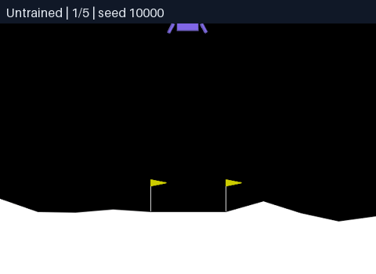
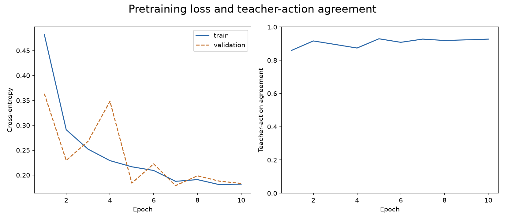
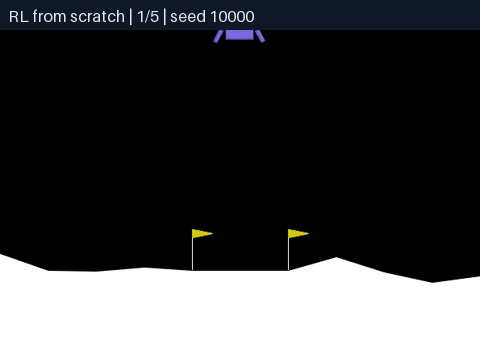
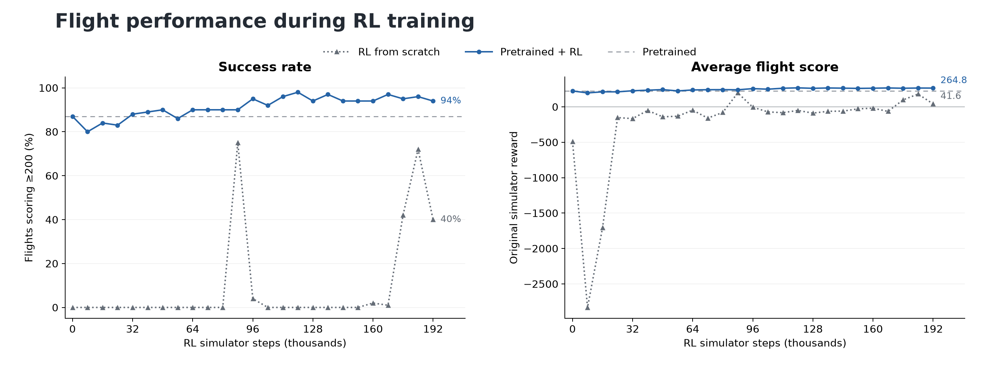

# GPT from Scratch

A GPT-style decoder-only Transformer with multi-head Attention and **100k parameters**, built from scratch in PyTorch.

<table width="50%" align="center"><td>

---

</td></table>

I repurposed the GPT architecture to land Gymnasium's LunarLander because:
1. I don't have enough compute to train a good language model locally.
2. I wanted an easy way to incorporate RL.
3. I like visuals.

---

<table width="100%">
  <tr>
    <th width="33%">Untrained</th>
    <th width="33%">Pretrained</th>
    <th width="33%">Pretrained + RL</th>
  </tr>
  <tr>
    <td></td>
    <td></td>
    <td></td>
  </tr>
</table>

<blockquote>
  <sub>We generated the training data from simulating Gymnasium's handwritten heuristic over 300 flights / 75,949 state–action examples.<br>
  RL then picks up from the best validation checkpoint and learns from simulator rewards.</sub>
</blockquote>


## Parameter count

| Component | Calculation | Parameters |
| :--- | :--- | ---: |
| State embedding | `8 × 64 + 64` | 576 |
| Position embedding | `8 × 64` | 512 |
| K/Q/V projections ×3 | `2 × 3 × 4 × 64 × 16` | 24,576 |
| Attention output projections | `2 × (64 × 64 + 64)` | 8,320 |
| Feedforward (64 → 256 → 64) | `2 × (64 × 256 + 256 × 64 + 256 + 64)` | 66,176 |
| LayerNorms ×2 | `2 × 2 × (64 + 64)` | 512 |
| **Transformer blocks ×2 subtotal** | `2 × 49,792` | **99,584** |
| Final LayerNorm | `2 × 64` | 128 |
| Action head | `64 × 4 + 4` | 260 |
| **GPT total** | | **101,060** |

---

## Design

```
INPUT: history of 8 observations
Each observation contains 8 physical measurements
Shape: (B, 8, 8) -- (B is batch size)
          │
          ▼
STATE EMBEDDING: Linear(8 → 64)
Each observation becomes a 64-dimensional vector
          │
          ▼
ADD POSITION EMBEDDINGS
Shape: (B, 8, 64)
          │
          ▼
┌────────────── TRANSFORMER BLOCK 1 ───────────────┐
│                                                  │
│  x ─────────────────────────────────┐            │
│  │                                  │            │
│  ▼                                  │            │
│  LayerNorm                          │            │
│  │                                  │            │
│  ▼                                  │            │
│  MULTI-HEAD ATTENTION               │            │
│  Same 64 features go to EVERY head  │            │
│  │                                  │            │
│  ├── Head 1 ──► 16 features         │            │
│  ├── Head 2 ──► 16 features         │            │
│  ├── Head 3 ──► 16 features         │            │
│  └── Head 4 ──► 16 features         │            │
│         │                           │            │
│         ▼                           │            │
│  Concatenate: 16 × 4 = 64           │            │
│         │                           │            │
│         ▼                           │            │
│  Projection: Linear(64 → 64)        │            │
│         │                           │            │
│         ▼                           │            │
│       ADD ◄─────────────────────────┘            │
│         │              Residual connection       │
│         ├───────────────────────────┐            │
│         ▼                           │            │
│  LayerNorm                          │            │
│         │                           │            │
│         ▼                           │            │
│  FEEDFORWARD                        │            │
│  Linear(64 → 256)                   │            │
│         │                           │            │
│        ReLU                         │            │
│         │                           │            │
│  Linear(256 → 64)                   │            │
│         │                           │            │
│         ▼                           │            │
│       ADD ◄─────────────────────────┘            │
│         │              Residual connection       │
│  Output: (B, 8, 64)                              │
└─────────┬────────────────────────────────────────┘
          │
          ▼
TRANSFORMER BLOCK 2
...
Same Structure
...
          │
          ▼
FINAL LAYERNORM
Shape: (B, 8, 64)
          │
          ▼
SELECT THE NEWEST TIMESTEP
Shape: (B, 64)
          │
          ▼
ACTION HEAD: Linear(64 → 4)
Shape: (B, 4)
          │
          ▼
Four action scores:
[nothing, left engine, main engine, right engine]
```

Inside each attention head:

```
Input: (B, 8, 64)
          │
     ┌────┼────────────────┐
     ▼    ▼                ▼
   Query  Key             Value
   64→16  64→16           64→16
     │    │                │
     └─┬──┘                │
       ▼                   │
  Q × Kᵀ / √16             │
       │                   │
  Mask future positions    │
       │                   │
    Softmax                │
       │                   │
  Attention weights        │
  Shape: (B, 8, 8)         │
       │                   │
       └─────── × ─────────┘
                │
                ▼
       Output: (B, 8, 16)
```

---

## Training

| Model | Success Rate | Average Score | Teacher-Action Agreement |
| :--- | ---: | ---: | ---: |
| Untrained | 0% | -491.1 | 5.95% |
| Pretrained | 87% | 224.3 | 92.72% |
| RL | 40% | 41.6 | 50.27% |
| Pretrained + RL | **94%** | **264.8** | 82.92% |

Both RL stages used 192,000 simulator steps. All four models use the same 100 test flights for the table and gifs above. Success means scoring at least 200. Teacher-action agreement measures imitation of the Gymnasium heuristic policy, not flight performance.

### 1. Pretraining

Pretraining uses supervised learning to predict actions. We generated the training dataset of 300 flights / 75,949 state–action examples from Gymnasium's LunarLander heuristic, trained for 10 epochs, and kept the checkpoint with the lowest validation loss.



### 2. Reinforcement learning (PPO)

```text
                     ┌→ existing action head: choose an action
Pretrained GPT ──────┤
                     └→ new value head for RL: predict future reward
```

PPO starts with the pretrained GPT and action head. We then use SB3 to add a randomly initialized `nn.Linear(64, 1)` value head (65 parameters) to predict future reward from the same network. 


The actor loss trains the action head, the value loss trains the value head, and both update the shared GPT.

<p align="center">
  <br>
  <sub>We also trained the network from scratch using RL for <del> fun</del> science.</sub>
</p>

After RL, success rose from **87% to 94%**, while teacher-action agreement fell from 92.72% to 82.92%. The model also improved its flight performance while matching the teacher less often: the beginnings of emergent behavior.




---

## Run locally

From the repository root:

```bash
pyenv local 3.12
python -m venv .venv
source .venv/bin/activate
pip install -r requirements.txt

python -m src.environment     # Watch the heuristic fly
python -m src.initialize      # Save a randomly initialized GPT
python -m src.data            # Generate the training dataset
python -m src.pretrain        # Learn the heuristic's actions
python -m src.rl_finetuning   # PPO from the pretrained GPT
python -m src.rl_from_scratch # PPO from the untrained GPT
python -m src.evaluate        # Evaluate the four models and checkpoint progress
python -m src.plot            # Regenerate the graphs above
python -m src.gif             # Regenerate the four model comparison GIFs
```
---

## References

- [3Blue1Brown: Neural Networks Series](https://www.youtube.com/watch?v=aircAruvnKk&list=PLZHQObOWTQDMRtm8h9bG9P06WINNoBnCR)
- [Attention Is All You Need](https://arxiv.org/abs/1706.03762)
- [Neural Networks: Zero to Hero](https://karpathy.ai/zero-to-hero.html)
- [OpenAI: Introducing GPT](https://openai.com/index/language-unsupervised/)
- [Gymnasium](https://gymnasium.farama.org/environments/box2d/lunar_lander/)
